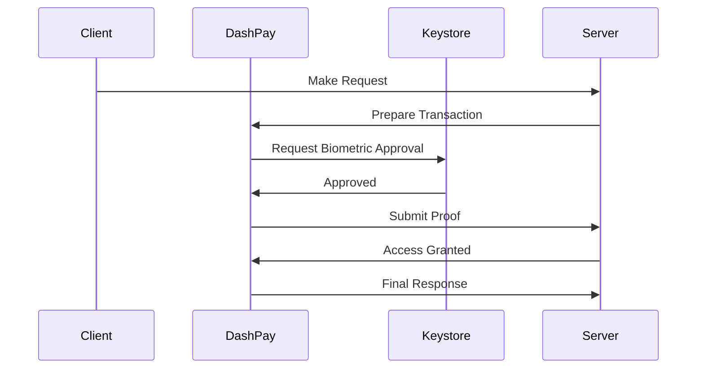

# Payment Debugger (PDB)

## Overview

DashPay includes a built-in Payment Debugger — a local web UI that visualizes every 402 challenge-response cycle as a sequence diagram.

## Features

- **Real-time visualization**: See headers, protocol, and flow
- **Sequence diagrams**: Mermaid diagrams for request/response flow
- **Session management**: Track multiple payment sessions
- **Error highlighting**: Clearly show where things went wrong
- **Protocol detection**: Automatically detects MPP vs x402
- **Local-only**: No data leaves your machine

## Starting the Debugger

### Command Line

```sh
dashpay server start --debugger spec.yml
```

### Demo Mode

```sh
dashpay server demo
```

Starts a demo environment with:
- Sample API endpoints
- Sandbox RPC
- Payment Debugger UI

## Session Events

| Event | Description |
|-------|-------------|
| RequestStart | New HTTP request initiated |
| HeadersSent | Headers prepared for request |
| ChallengeReceived | 402 response with payment challenge |
| PaymentApproved | User approved via biometrics |
| ProofSubmitted | Payment proof sent to server |
| ResponseReceived | Final response from server |
| Error | Payment or protocol error occurred |
| Complete | Flow completed successfully |

## Sequence Diagram Format

The debugger generates Mermaid sequence diagrams showing the complete payment flow:



## Web UI

The debugger runs on `http://localhost:3000` by default.

### Pages

- **Dashboard**: Overview of active sessions
- **Session Detail**: Full sequence diagram for a payment
- **Raw Data**: Headers and bodies for inspection
